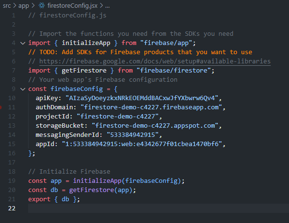
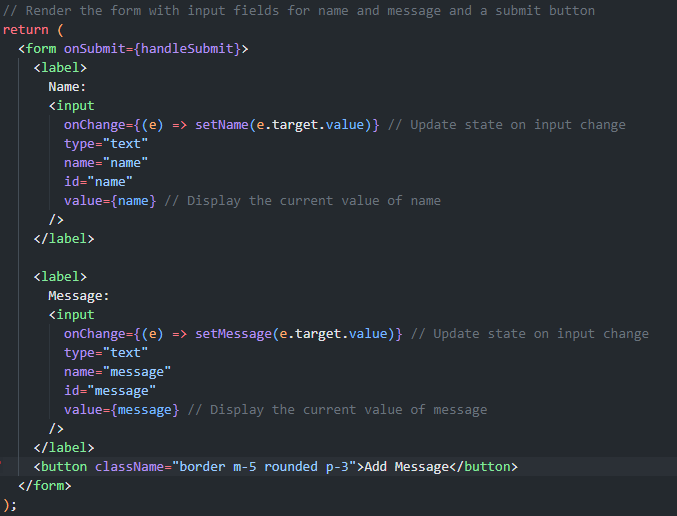
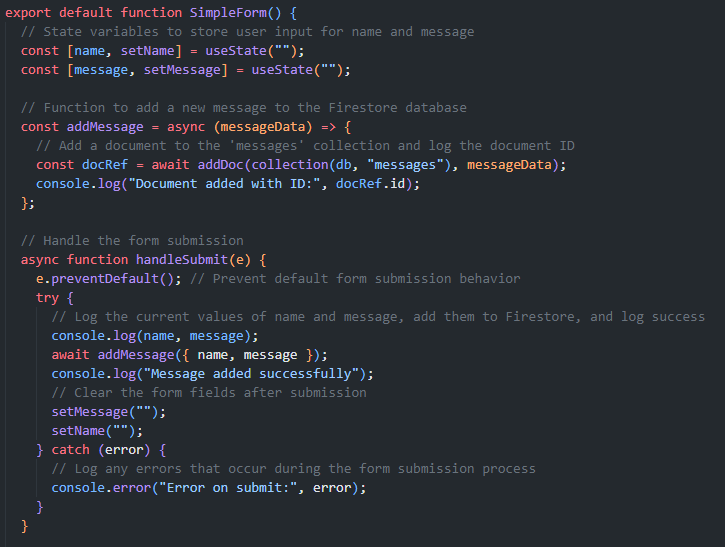
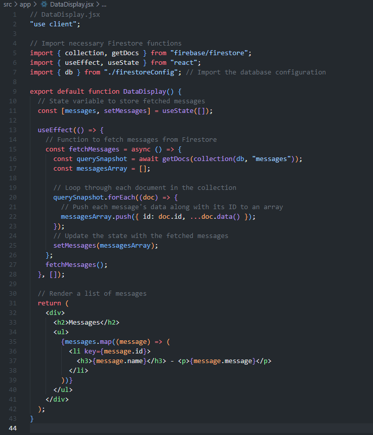
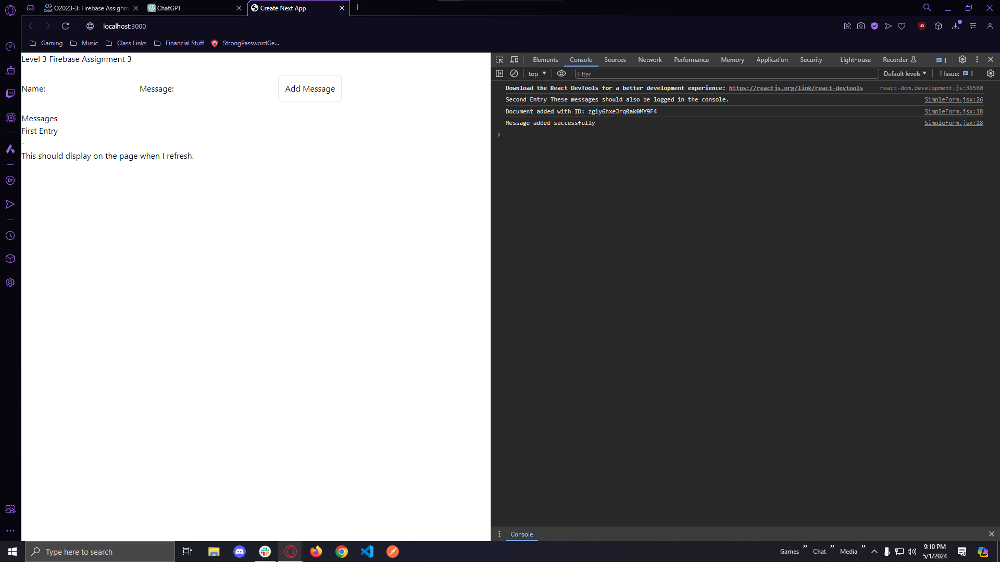

# Objective

To integrate Firestore into a Next.js application, demonstrating the ability to add new data to Firestore and display this data within the application. This exercise focuses on initializing Firestore, simple data modeling, and executing create and read operations.

# Instructions

## Part 1: Firestore Setup

Initialize Firestore in your Next.js project according to the provided demo code instructions.

Ensure Firestore is correctly configured in a firebaseConfig.js file.

## Part 2: Adding Data to Firestore

### Develop a SimpleForm Component:

This component should include input fields for at least two pieces of data (e.g., a user's name and message).

Implement the functionality to add a new document to a Firestore collection upon form submission. You may name the collection as you wish, such as messages.

## Part 3: Displaying Data from Firestore

### Create a DataDisplay Component:

This component is responsible for fetching documents from the Firestore collection used in SimpleForm and displaying the data in a list or another appropriate format.

## Part 4: Documentation and Submission

### Logging and README.md:

Ensure successful document additions to Firestore are confirmed via console logging (e.g., "Document added with ID: XYZ").

Update the README.md file with a brief explanation of your integration process, challenges encountered, and their resolutions.

### Credits:
Credit to ChatGPT for assistance in tailoring class code to fit assignment and explanations of Firebase, as well as code comments.